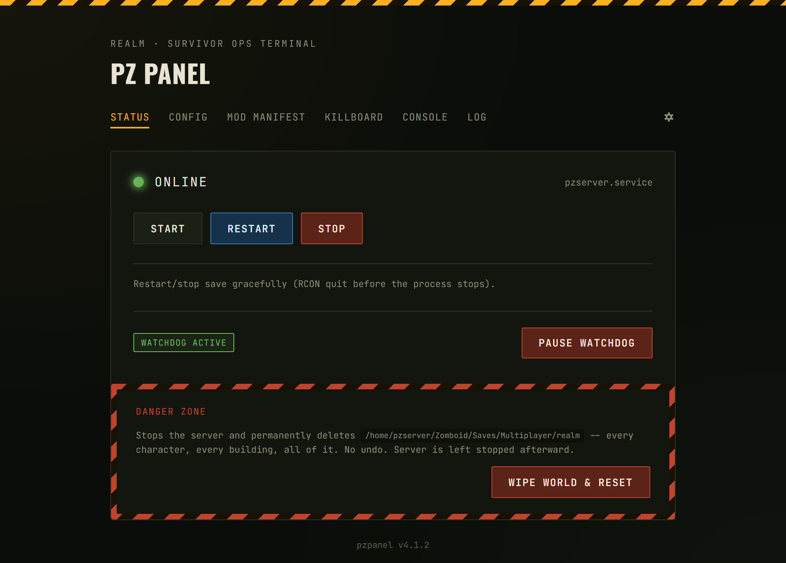
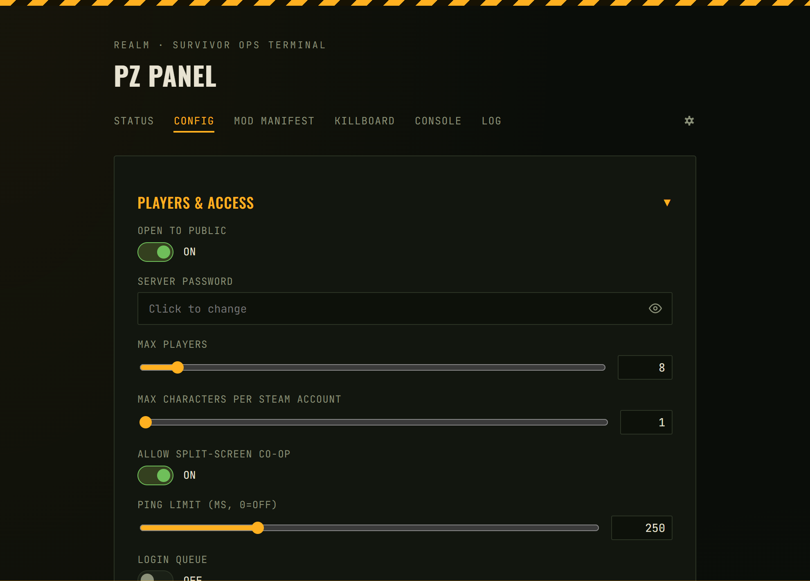
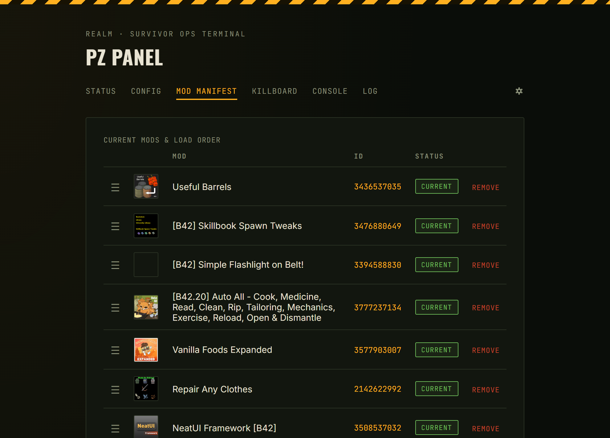
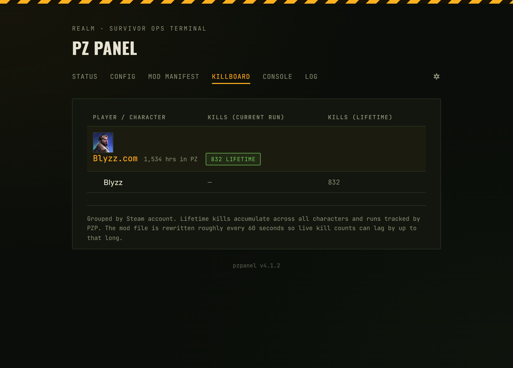
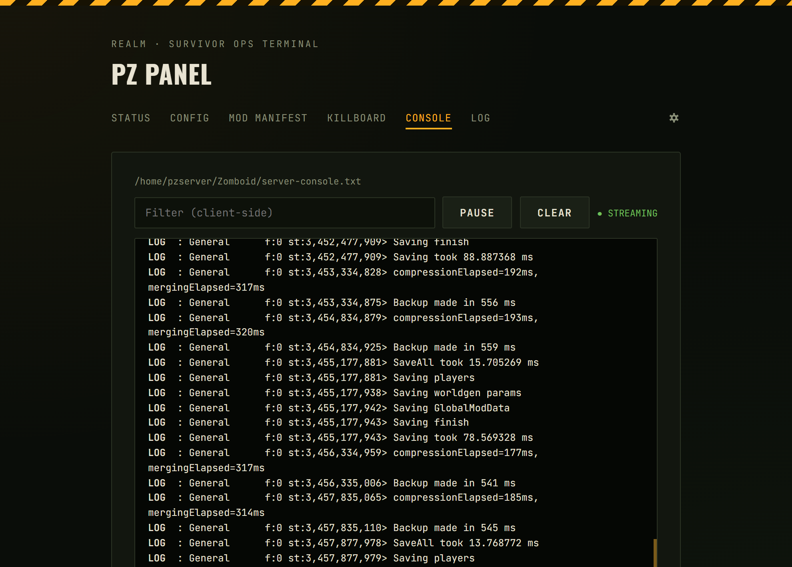
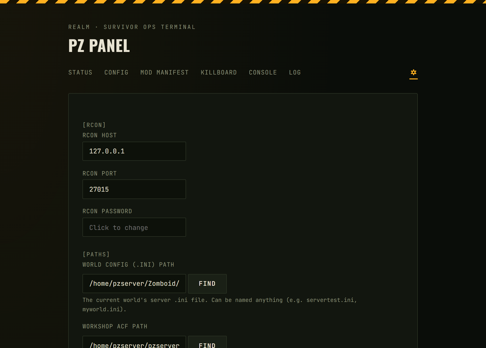

# PZ Panel &nbsp;·&nbsp; v4.1.3

A web-based control panel for a **Project Zomboid B42 dedicated server**. Manage your server, mods, and players from a browser — on Linux or Windows.

<table>
<tr>
<td></td>
<td></td>
<td></td>
</tr>
<tr>
<td></td>
<td></td>
<td></td>
</tr>
</table>

## Features

- **Status page** — start, stop, restart with live status indicator
- **Config page** — edit server `.ini` settings directly from the browser (collapsible sections, cascading PVP/chat/safehouse toggles)
- **Mod Manifest** — see all Workshop mods, update status, drag-to-reorder, add/remove with optional live-server restart
- **Killboard** — per-player kill tracking (current run + lifetime), backed by a companion PZ Lua mod
- **Console** — live streaming log view with filter and pause
- **Log** — action history for everything the panel touches
- **Settings** — grouped, collapsible settings page with Linux/Windows platform toggle

---

## Requirements

- Python 3.11+
- A running Project Zomboid B42 dedicated server
- RCON enabled on the server (`RCONPort` and `RCONPassword` set in your server `.ini`)

---

## Installation (Linux)

```bash
# Clone into /opt/pzp
sudo git clone https://github.com/Blyzz616/pzp.git /opt/pzp
sudo chown -R pzserver:pzserver /opt/pzp

# Create and activate a virtualenv
sudo -u pzserver python3 -m venv /opt/pzp/venv
sudo -u pzserver /opt/pzp/venv/bin/pip install fastapi uvicorn requests

# Copy and edit config
sudo -u pzserver cp /opt/pzp/pzpanel.ini.example /opt/pzp/pzpanel.ini
# Edit /opt/pzp/pzpanel.ini — set [rcon] and [paths] at minimum

# Install and start the systemd service
sudo cp /opt/pzp/pzpanel.service /etc/systemd/system/
sudo systemctl daemon-reload
sudo systemctl enable --now pzpanel
```

---

## Installation (Windows)

1. Clone or download the repo into a folder (e.g. `C:\pzp`)
2. Install Python 3.11+ and run:
   ```
   pip install fastapi uvicorn requests
   ```
3. Copy `pzpanel.ini.example` → `pzpanel.ini` and fill in `[rcon]` and `[paths]`
4. Run `pzpanel_windows.bat` to start the panel

---

## Configuration

Open `pzpanel.ini` (or use the Settings page in the panel itself). Minimum required:

```ini
[rcon]
host = 127.0.0.1
port = 27015
password = your_rcon_password

[paths]
server_ini = /home/pzserver/Zomboid/Server/servertest.ini
workshop_acf = /home/pzserver/.steam/steam/steamapps/workshop/appworkshop_108600.acf
console_log = /home/pzserver/Zomboid/server-console.txt
```

Everything else is optional — the Settings page has descriptions for each field.

---

## Updating

```bash
cd /opt/pzp
sudo -u pzserver git pull
sudo chown -R pzserver:pzserver /opt/pzp/*
sudo systemctl restart pzpanel
```

---

## Kill Tracking (PZP Mod)

The Killboard page requires the companion Lua mod installed on your server:

**Workshop ID:** [3793020885](https://steamcommunity.com/sharedfiles/filedetails/?id=3793020885)  
**Mod ID:** `pzp`

Once installed, set `kills_file` in `pzpanel.ini` under `[player_events]` to point at the mod's output file (`pzp_player_kills.txt` in your server's Zomboid data directory), then restart the panel.

---

## Discord Integration

Create a webhook in your Discord server (Server Settings → Integrations → Webhooks) and paste the URL into `pzpanel.ini`:

```ini
[discord]
webhook_url = https://discord.com/api/webhooks/...
```

Restart the panel for it to take effect. The panel posts embeds on player join/leave/death and server up/down events.

---

## Accessing the panel remotely

There is currently no built-in authentication - do not do this.

---

## File layout

```
/opt/pzp/
├── main.py                  # FastAPI app — all pages and routes
├── platform_compat.py       # OS abstraction (Linux/Windows)
├── discord_module.py        # Player-event watcher + Discord embeds
├── player_db.py             # SQLite kill/session tracking
├── mod_restart.py           # Mod-update watchdog
├── modcheck.py              # Workshop update checks
├── steam_workshop.py        # Steam API lookups
├── rcon.py                  # RCON client
├── actionlog.py             # Panel action log
├── countdown_control.py     # Restart countdown state
├── automation.py            # Watchdog pause flag
├── removed_mods.py          # Previously-removed mod list
├── graceful_stop.py         # Graceful server stop helper
├── acf.py                   # Steam ACF parser
├── pzpanel.ini.example      # Config template
├── pzpanel.service          # systemd unit
├── pzpanel_windows.bat      # Windows launcher
└── pzp/
    └── screens/             # UI screenshots
```

---

## Version

**v4.1.3** — ghost death fix, grouped settings page with OS toggle, killboard mod image, screenshots

See `CHANGELOG.md` for full history.
