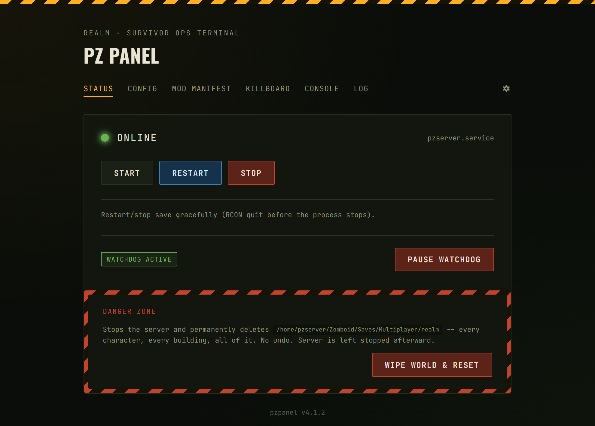
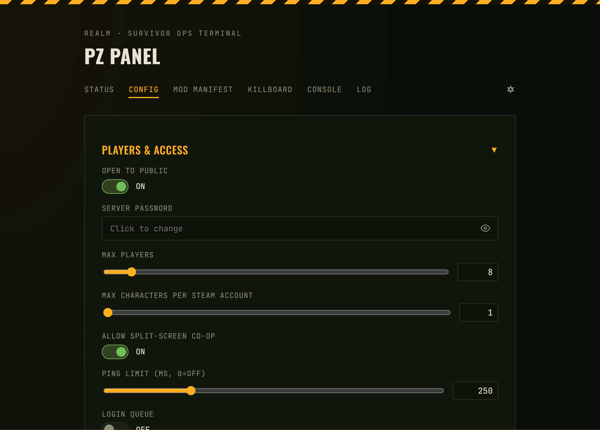
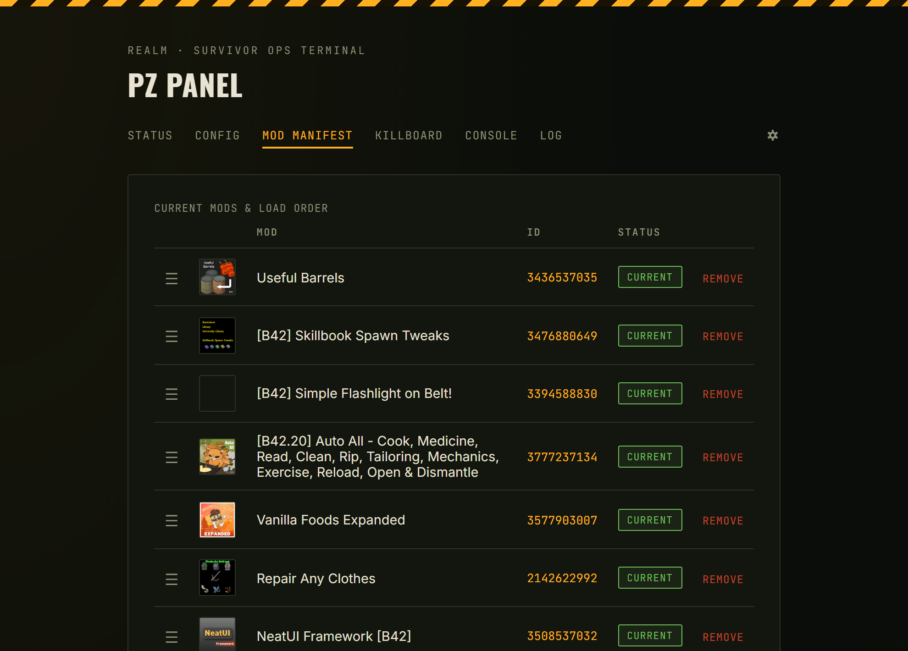
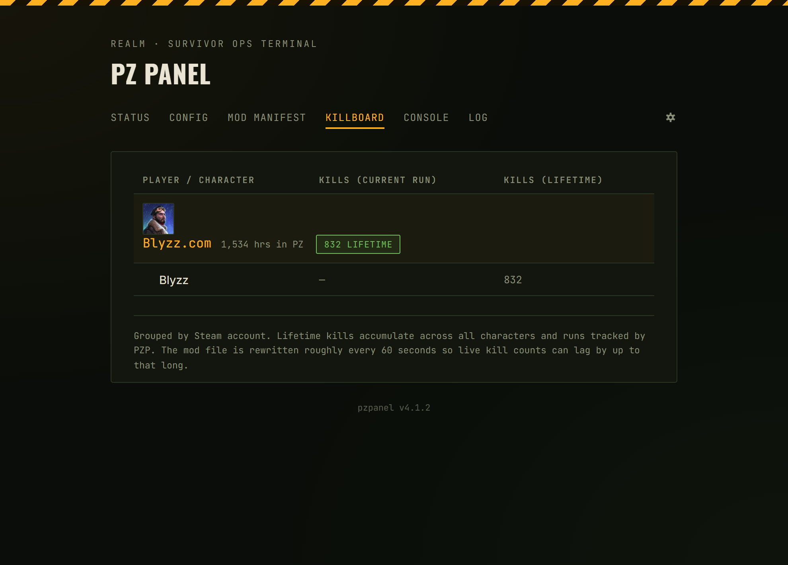
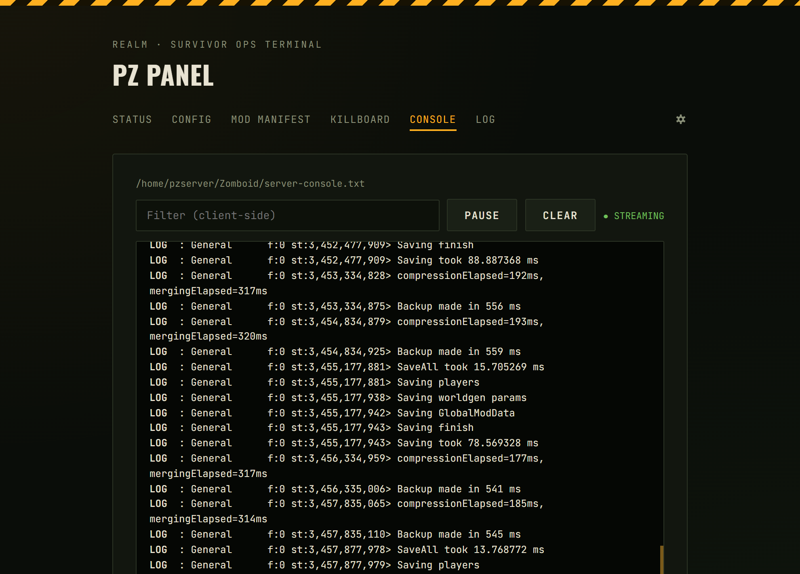
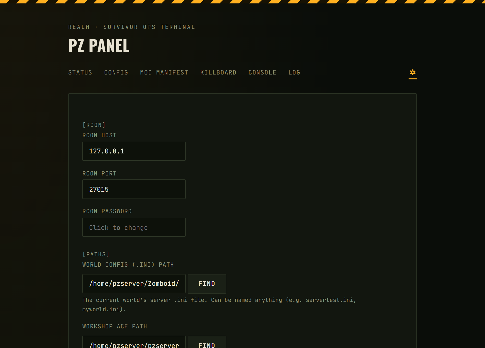

# PZ Panel &nbsp;·&nbsp; v5.0.0

A web-based control panel for a **Project Zomboid B42 dedicated server**. Manage your server, mods, and players from a browser — on Linux or Windows.

<table>
<tr>
<td></td>
<td></td>
<td></td>
</tr>
<tr>
<td></td>
<td></td>
<td></td>
</tr>
</table>

## Features

- **Status page** — start, stop, restart with live status indicator
- **Config page** — edit server `.ini` settings directly from the browser (collapsible sections, cascading PVP/chat/safehouse toggles)
- **Mod Manifest** — see all Workshop mods, update status, drag-to-reorder, add/remove with optional live-server restart. Add/Enable while the server's online queues the change for the next restart instead of forcing a stop. Surfaces when a mod's been downloaded (`WorkshopItems=`) but not yet loaded (`Mods=`) and offers a one-click Enable, closing the most common "I added a mod and it's not working" gap. Workshop items that bundle several mods get a checkbox picker so you choose which internal IDs go into `Mods=`
- **Killboard** — kills per Steam player, per account and per character (alive or dead), plus real time on the server, backed by a companion PZ Lua mod
- **Console** — live streaming log view with filter and pause; switch between the main console log and any other log currently present in `Logs/` (connections, user, chat, cmd, PerkLog, etc.)
- **Log** — action history for everything the panel touches
- **Settings** — grouped, collapsible settings page with Linux/Windows platform toggle

---

## Requirements

- Python 3.11+
- A running Project Zomboid B42 dedicated server
- RCON enabled on the server (`RCONPort` and `RCONPassword` set in your server `.ini`)

---

## Installation (Linux)

```bash
# Clone into /opt/pzp
sudo git clone https://github.com/Blyzz616/pzp.git /opt/pzp
sudo chown -R pzserver:pzserver /opt/pzp

# Create and activate a virtualenv
sudo -u pzserver python3 -m venv /opt/pzp/venv
sudo -u pzserver /opt/pzp/venv/bin/pip install -r /opt/pzp/requirements.txt

# Copy and edit config
sudo -u pzserver cp /opt/pzp/pzpanel.ini.example /opt/pzp/pzpanel.ini
# Edit /opt/pzp/pzpanel.ini — set [rcon] and [paths] at minimum

# Install and start the systemd service
sudo cp /opt/pzp/pzpanel.service /etc/systemd/system/
sudo systemctl daemon-reload
sudo systemctl enable --now pzpanel
```

---

## Installation (Windows)

1. Clone or download the repo into a folder (e.g. `C:\pzp`)
2. Install Python 3.11+ and run:
   ```
   pip install -r requirements.txt
   ```
3. Copy `pzpanel.ini.example` → `pzpanel.ini` and fill in `[rcon]` and `[paths]`
4. Run `pzpanel_windows.bat` to start the panel

---

## Configuration

Open `pzpanel.ini` (or use the Settings page in the panel itself). Minimum required:

```ini
[rcon]
host = 127.0.0.1
port = 27015
password = your_rcon_password

[paths]
server_ini = /home/pzserver/Zomboid/Server/servertest.ini
workshop_acf = /home/pzserver/.steam/steam/steamapps/workshop/appworkshop_108600.acf
console_log = /home/pzserver/Zomboid/server-console.txt
```

Everything else is optional — the Settings page has descriptions for each field.

---

## Updating

```bash
cd /opt/pzp
sudo -u pzserver git pull
sudo chown -R pzserver:pzserver /opt/pzp/*
sudo systemctl restart pzpanel
```

---

## Kill Tracking (PZP Mod)

The Killboard page requires the companion Lua mod installed on your server:

**Workshop ID:** [3793020885](https://steamcommunity.com/sharedfiles/filedetails/?id=3793020885)  
**Mod ID:** `pzp`

Add it to the server's Mods/WorkshopItems and restart the server. The mod appends each character's kill count and in-game time survived to `Zomboid/Lua/pzp_events.log` (on load or creation, every 15 seconds while the count is changing, and on death). The panel reads that file into its own database (`pzp_kills.sqlite` in the panel's data directory). Both paths have defaults; override them with `event_log` / `kills_db` under `[player_events]` only if yours differ.

Kills are tracked per character and summed per account and per Steam player. A Steam player can use several server accounts; each account has at most one living character and any number of dead ones. Tracking starts from the first report the mod sends. Nothing is imported from older versions.

---

## Discord Integration

Create a webhook in your Discord server (Server Settings → Integrations → Webhooks) and paste the URL into `pzpanel.ini`:

```ini
[discord]
webhook_url = https://discord.com/api/webhooks/...
```

Restart the panel for it to take effect. The panel posts embeds for:

- **Server up / down**
- **Join** — Steam profile link and avatar, the player's total kills, PZ hours on record, the account logging in with its kills and its living character's kills, and the two most recent other games played (needs `[steam]` with an API key for hours/games)
- **Disconnect** — real time online this session, total time on the server, and kills this session (from joining to leaving, across any characters that died in between). If the player's character died and they left before making a new one, it's posted as a rage-quit
- **Death** — character name (or account name), kills this run, in-game time survived
- **Kill milestones** — per character and per player, each posted once when crossed

---

## Accessing the panel remotely

There is currently no built-in authentication - do not do this.

---

## File layout

```
/opt/pzp/
├── main.py                  # FastAPI app — all pages and routes
├── platform_compat.py       # OS abstraction (Linux/Windows)
├── discord_module.py        # Player-event watcher + Discord embeds
├── player_db.py             # SQLite store: players, accounts, characters, sessions
├── mod_restart.py           # Mod-update watchdog
├── ini_safe.py              # Backup + atomic writes for realm.ini
├── modcheck.py              # Workshop update checks (WorkshopItems=/Mods=)
├── steam_workshop.py        # Steam API lookups
├── rcon.py                  # RCON client
├── actionlog.py             # Panel action log
├── countdown_control.py     # Restart countdown state
├── automation.py            # Watchdog pause flag
├── removed_mods.py          # Previously-removed mod list
├── pending_mods.py          # Mod changes queued for the next restart
├── graceful_stop.py         # Graceful server stop helper
├── acf.py                   # Steam ACF parser
├── server_config.py         # Config loading, server control, INI helpers
├── ui_helpers.py            # HTML rendering helpers
├── discord_webhook.py       # Shared Discord webhook client
├── kill_tracker.py          # Reads the mod's event log into player_db, milestones
├── pzpanel.ini.example      # Config template
├── pzpanel.service          # systemd unit
├── pzpanel_windows.bat      # Windows launcher
└── pzp/
    ├── 42/                  # Workshop mod (mod.info, media/lua/{client,server,shared})
    └── screens/             # UI screenshots
```

---

## Version

**v5.0.0** — major rewrite of kill tracking: the Workshop mod now reports deaths and character names and appends to an event log the panel actually reads; kills are stored per character in a new database and summed per account and player; session kills and time on server survive panel restarts; join/disconnect/rage-quit/death embeds reworked; milestones post once. **Needs a Workshop update of the `pzp` mod.** v4.6.4: `requests` added to `requirements.txt` (the panel imports it at startup) and install steps now use `pip install -r requirements.txt` (adds the missing `python-multipart`); v4.6.3: description BBCode repairs truncated/odd markup (`[hr][/hr]`, cut-off `[b]`), adds `[quote]`/`[code]`/`[spoiler]`/`[img]`, and only allows http(s) links; v4.6.2: scrollbars match the dark theme and truncated descriptions no longer show raw `[list]`/`[*]` tags; v4.6.1: every panel edit of the server `.ini` is now backed up (`backups/`, newest 20) and written atomically; the Enable modal shows a checkbox picker (with each mod's `mod.info` name) when a Workshop item bundles more than one internal mod ID, so you pick which go into `Mods=`; "Needs Enable" now triggers only when none of a mod's IDs are enabled, so deliberately skipped placeholder IDs stop nagging.

See `CHANGELOG.md` for full history.
